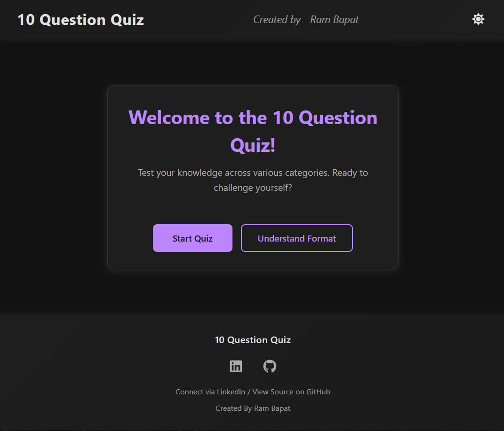
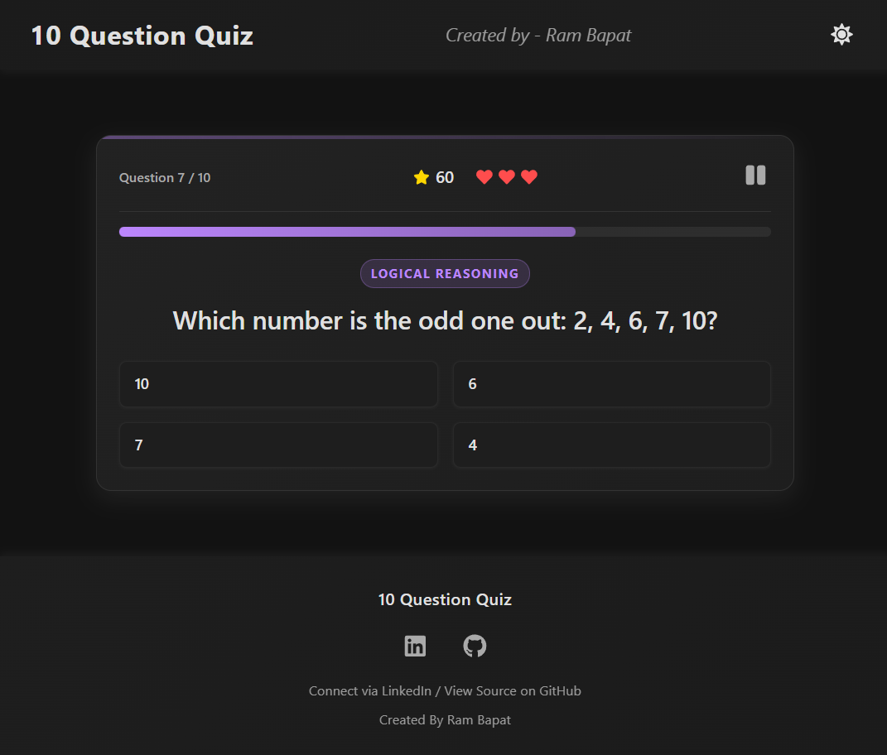
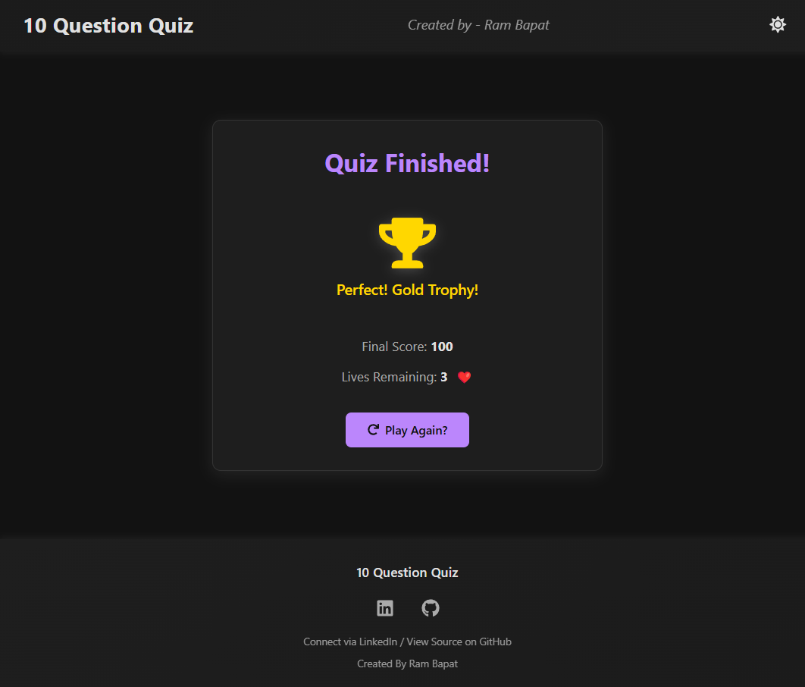
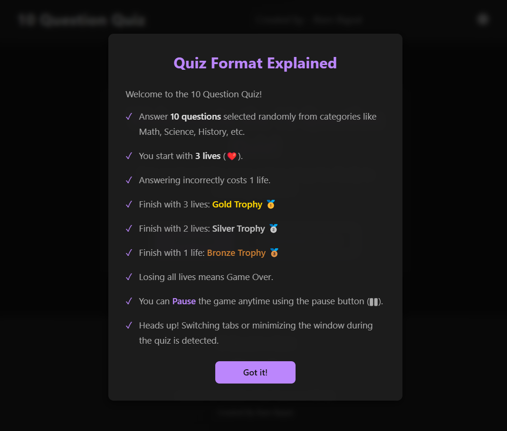

# 10 Question Quiz (React + Vite) 🧠🏆✨

## Try live demo - [Demo](https://10-question-quiz.vercel.app/)

A sleek, modern, and engaging 10-question quiz application built with React and Vite. Test your knowledge across various categories with a lives and trophy system!

<!-- ================================================== -->







<!-- ================================================== -->

## Overview

This project is an interactive quiz application designed as part of the #30DaysOfVibeCoding challenge. It presents users with 10 randomly selected questions from a larger pool, covering categories like Math, Science, History (with an Indian focus), Grammar, Geography, Logical Reasoning, and General Knowledge.

The quiz features:
*   A 3-lives system where incorrect answers cost a life.
*   A trophy system (Gold, Silver, Bronze) awarded based on remaining lives.
*   A dark/light theme toggle with user preference saved locally.
*   Detection of tab switching during the quiz.
*   A modern, responsive user interface with engaging animations and feedback.

## Features

*   **Start Screen:** Welcoming screen with options to start the quiz or understand the format.
*   **Format Modal:** Clear explanation of the quiz rules, lives, and trophy system.
*   **Randomized Questions:** Selects 10 questions, ensuring category distribution (2 per category initially, then random).
*   **Shuffled Options:** Answer choices for each question are randomly shuffled.
*   **Interactive Quiz Interface:** Displays current question, progress, score, and remaining lives.
*   **Suspenseful Feedback:** Selected answers are highlighted yellow before revealing correct (green) or incorrect (red) status with visual cues (icons/animations).
*   **Lives System:** Users start with 3 lives, losing one for each incorrect answer.
*   **Trophy System:** Awards Gold (3 lives), Silver (2 lives), or Bronze (1 life) trophies upon completion.
*   **Game Over State:** Screen shown when all lives are lost.
*   **Pause Functionality:** Allows users to pause the quiz mid-game.
*   **Theme Toggle:** Switch between dark (default) and light themes, saving the preference in `localStorage`.
*   **Tab Switching Detection:** Monitors if the user navigates away from the tab during the quiz and displays a warning modal upon return.
*   **Responsive Design:** Adapts to different screen sizes (desktop, tablet, mobile).
*   **Modern UI/UX:** Features gradients, shadows, smooth transitions, and icon usage for an enhanced look and feel.
*   **Data-Driven:** Questions loaded from a local JSON file (`questions.json`).

## Tech Stack

*   **Frontend:** React 18+
*   **Build Tool:** Vite
*   **Styling:** CSS3 (including Flexbox, Grid, Custom Properties/Variables, Gradients, Animations)
*   **Language:** JavaScript (ES6+)
*   **Icons:** `react-icons`
*   **Package Manager:** npm

## Getting Started

To get a local copy up and running, follow these simple steps.

### Prerequisites

*   Node.js (v18 or later recommended, includes npm) installed on your system. You can download it from [nodejs.org](https://nodejs.org/).
*   Git (for cloning the repository).

### Installation & Setup

1.  **Clone the repository:**
    ```bash
    git clone https://github.com/Barrsum/10-Question-Quiz.git
    ```

2.  **Navigate to the project directory:**
    ```bash
    cd 10-Question-Quiz
    ```

3.  **Install NPM packages:**
    ```bash
    npm install
    ```

### Running the Project

1.  **Start the development server:**
    ```bash
    npm run dev
    ```
    This command will start the Vite development server.

2.  **Open the application:**
    Open your web browser and navigate to the local URL provided by Vite (usually `http://localhost:5173/` or a similar port).

## Vibe Coding & AI Assistance Notes

This project was developed as part of the **#30DaysOfVibeCoding** challenge (April 2025). A significant portion of the code structure, component logic, styling ideas, and debugging was facilitated through collaboration with AI.

The process involved:
*   Defining high-level requirements and features.
*   Prompting the AI for initial code generation for components and logic.
*   Iteratively refining the code, styling, and functionality based on AI suggestions and testing.
*   Using AI for debugging errors and implementing specific features like tab detection and state management.
*   Generating the initial question dataset structure and sample questions.

This approach allowed for rapid prototyping and exploration of different implementation ideas, focusing on the overall structure and user experience while leveraging AI for boilerplate code and complex logic segments.

## Contributing

Contributions, issues, and feature requests are welcome! Feel free to check the [issues page](https://github.com/Barrsum/10-Question-Quiz/issues).

1.  Fork the Project
2.  Create your Feature Branch (`git checkout -b feature/AmazingFeature`)
3.  Commit your Changes (`git commit -m 'Add some AmazingFeature'`)
4.  Push to the Branch (`git push origin feature/AmazingFeature`)
5.  Open a Pull Request

## License

Distributed under the MIT License. See `LICENSE.md` for more information.

## Acknowledgements

*   **React:** [react.dev](https://react.dev/)
*   **Vite:** [vitejs.dev](https://vitejs.dev/)
*   **Icons:** Provided by [React Icons](https://react-icons.github.io/react-icons/).
*   **AI Assistance:** AI models for code generation, debugging, and refinement.

---

Built by Ram Bapat - Challenge [\#30DaysOfVibeCoding](https://www.linkedin.com/posts/ram-bapat-barrsum-diamos_vibecoding-ai-machinelearning-activity-7312839191153860608-wQ8y?utm_source=share&utm_medium=member_desktop&rcm=ACoAAEokGUcBG1WEFP4A_IMlyO4LNl-eu2MD52w) - [LinkedIn Profile](https://www.linkedin.com/in/ram-bapat-barrsum-diamos)